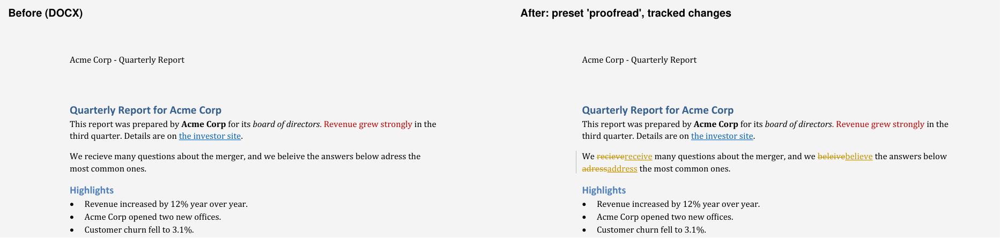
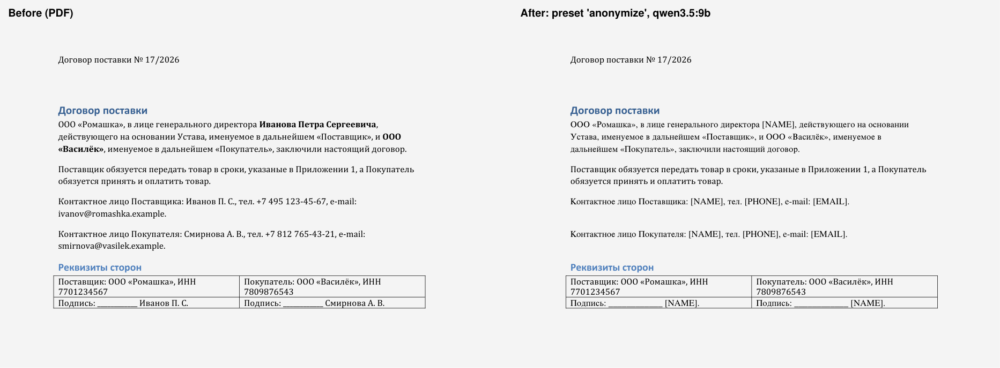
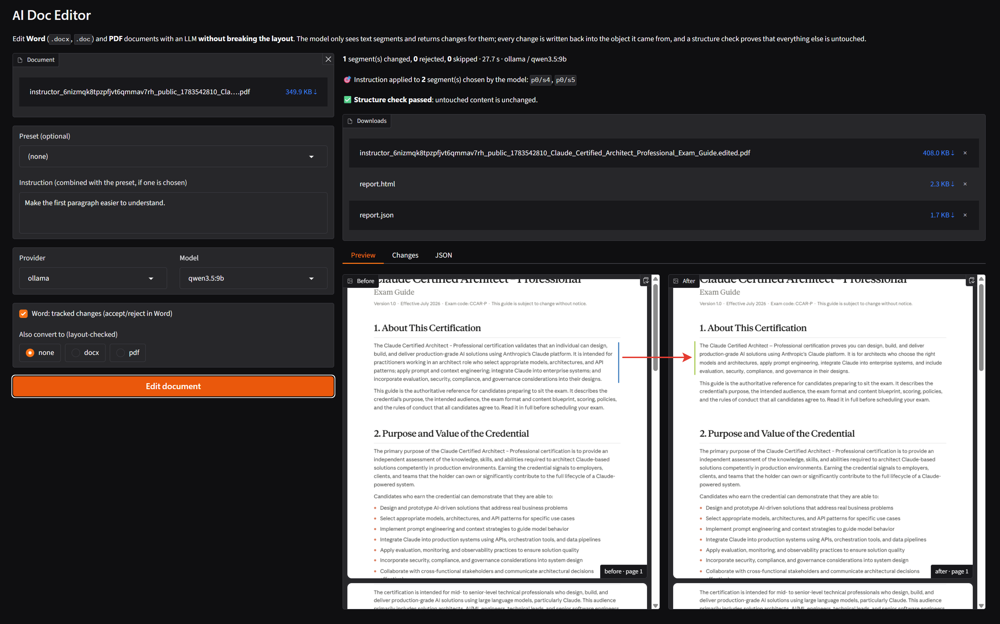

# ai-doc-editor

Edit Word and PDF documents with an LLM without breaking their layout.

Upload a `.docx`, `.doc` or `.pdf`, give an instruction ("replace Acme Corp with Contoso Ltd",
"make the tone formal", "remove personal data", "translate to English") or pick a preset, and get
the same document back with only the text changed. Tables, styles, margins, headers, images and
page breaks stay where they were. Word output carries **tracked changes**, so every AI edit can be
accepted or rejected in Word. Every run ends with an automatic **structure check** that proves the
untouched content is unchanged.

Runs fully offline with local models (Ollama, LM Studio). OpenAI, Anthropic and Google APIs and the
`claude`, `codex` and `agy` subscription CLIs plug in through the same interface.





## Example: one paragraph of a real PDF, rewritten by a local model



What the screenshot shows:

- **Input:** an 11-page exam guide printed to PDF from a browser (every line is its own text
  object, the fonts are embedded as Type3 subsets). No preset, one free-form instruction:
  *"Make the first paragraph easier to understand."*
- **Model:** `qwen3.5:9b` running locally in Ollama on a laptop GPU. Nothing leaves the
  machine. The whole run took 27.7 s.
- **Finding the target:** the model first saw only an outline of the document (segment IDs and
  the start of each paragraph) and chose the segments the instruction is about: `p0/s4` and
  `p0/s5`, the two paragraphs under "1. About This Certification". It then rewrote `p0/s4`, the
  first one, and left `p0/s5` as it was: **1 segment changed, 0 rejected, 0 skipped**.
- **Result (Before / After):** the first paragraph is shorter and simpler ("validates that an
  individual can" became "proves you can", the list of skills became plain verbs) and now takes
  4 lines instead of 5. The paragraph below it moved up by one line, in its original font,
  because the section reflows. The heading "2. Purpose and Value of the Credential", the bullet
  list, the title, the version line and the other 10 pages did not move by a single point.
- **Proof:** "Structure check passed" means the program compared the output with the input
  span by span: every untouched span has the same text and position, the moved paragraph sits
  exactly one line higher and overlaps nothing, and images and graphics are unchanged.
- **Honest limits, from the report:** the rewritten paragraph is set in a metric-similar sans
  font, because the original Type3 font is a subset that cannot set new words
  (`font_substituted`), and inline styling inside that paragraph is flattened
  (`style_flattened`). The Changes tab shows the word-level diff of the edit.

## Why most "AI document editors" break formatting

The usual approach converts the document to text or Markdown, asks the model to rewrite it, and
builds a new document from the answer. The model has no idea where a bold run started, which table
cell a sentence lived in, or how far a paragraph sat from the page edge, so the result looks like a
different document.

## How this one works

**The model never sees or writes a whole document.**

1. **Parse into segments.** Every Word paragraph (body, tables, headers, footers, text boxes) and
   every PDF paragraph gets a stable ID. PDF paragraphs are rebuilt from text lines, because PDF
   producers split and merge text unpredictably (a browser prints every line as its own block;
   other tools merge a heading with its paragraph or table cells with each other).
2. **Find the target.** For a free-form instruction ("make the first paragraph simpler"), the
   model first sees an outline of the document (segment IDs and the start of each text) and
   picks the segments the instruction is about. Only those are edited. Presets such as
   proofreading apply to the whole document.
3. **Ask for edits, not documents.** The model receives `[{id, text}]` and returns only what it
   changed: `{"edits": [{id, new_text}]}`, validated against a JSON schema. Unknown IDs and invalid
   answers are rejected and reported, never guessed at; so is an edit that empties a segment.
   Document text is treated as data, not as instructions.
4. **Write back in place.**
   - **Word:** a word-level diff between old and new text. Unchanged characters keep their
     original runs and formatting; only the changed words are replaced, as `w:ins` / `w:del`
     tracked changes (or directly). Nothing outside the edited runs is touched: no paragraph or
     section properties, no styles.
   - **PDF:** only edited paragraphs are rewritten. The old text is removed with redactions that
     leave images and vector graphics alone, and the new text is wrapped with real font metrics
     in the same font, size, colour and alignment. An edited paragraph may get **more or fewer
     lines**: the paragraphs below it **in the same section** move up or down with it (they are
     copied from the original page, fonts and all), while the next heading, graphics, images and
     everything after them stay exactly where they were. If the section has no room left, the
     model is asked to shorten the text, then the font may shrink to 80%; if it still does not
     fit, the original stays and the report says why. Paragraphs in boxes or table cells keep
     their own box.
5. **Prove it.** The structure check (`src/ai_doc_editor/invariants.py`) compares input and output:
   - Word: paragraph and table counts, table shapes, section properties, every other package
     part, the full XML of every unedited paragraph, the formatting of every unchanged character,
     and that rejecting all tracked changes restores the original text.
   - PDF: page count and sizes, images, vector graphics, the text and position (0.5 pt) of every
     untouched span, or its exact vertical shift if it moved within its section; new text must
     keep its colour, not shrink below 80% and not overlap any other text or graphics.

   Each check has a negative-control test that breaks the behaviour on purpose and expects the
   check to go red.

## Format conversion, behind a layout gate

DOCX to PDF and PDF to DOCX are available, but a conversion is only presented as done if it passes
a **layout gate**: the result is rendered again and compared with the source page by page (same
page count, margins within 2 pt, every word in the same place within 5 pt, same text). If the gate
fails, the file is named `*.LAYOUT-NOT-VERIFIED.*` and the report lists what moved, for example
`page 1: word 'Q3' moved 46.2 pt`.

Word is flow layout and PDF is fixed layout, so no converter can promise identical pages for every
document. This project measures each conversion instead of promising. On the bundled fixtures, a
one-column contract passes; a two-column PDF and a report with a merged-cell table do not, and the
gate says so.

## Quick start

You need an LLM backend. For local models, install [Ollama](https://ollama.com) (or LM Studio)
yourself and pull a model:

```bash
ollama pull qwen3.5:9b     # default; also tested: qwen3.5:4b, gemma4:12b (see "Measured results")
```

### Docker (includes LibreOffice)

```bash
cp .env.example .env       # optional: API keys, default model, APP_PORT
docker compose up --build
# UI:  http://localhost:8000/ui     API docs: http://localhost:8000/docs
```

Ollama and LM Studio are reached on the host through `host.docker.internal`. On Linux, start
Ollama with `OLLAMA_HOST=0.0.0.0` so the container can reach it.

### Locally (Python 3.12, uv)

```bash
uv sync
uv run poe serve           # http://127.0.0.1:8000/ui
```

LibreOffice is optional locally: it is needed for `.doc` input, DOCX to PDF, the PDF to DOCX gate
and DOCX previews. It is found on `PATH`, in the default Windows location, or via `SOFFICE_PATH`.

### Command line

```bash
uv run ai-doc-editor edit contract.docx -i "Replace Acme Corp with Contoso Ltd"
uv run ai-doc-editor edit contract.pdf --preset anonymize --provider cli:claude --model sonnet
uv run ai-doc-editor edit report.pdf --preset proofread --convert-to docx
uv run ai-doc-editor providers
```

Each run writes the edited file, `report.html` and `report.json` into an output folder.

### HTTP API

```bash
curl -X POST localhost:8000/api/edit \
  -F file=@contract.docx -F preset=proofread -F provider=ollama -F model=qwen3.5:9b \
  -F track_changes=true -F convert_to=pdf
```

The response holds download URLs for the result, the converted file and the reports, the gate
result and `structure_verified`. `GET /api/providers` lists providers, their models and presets.

## LLM backends

| Provider key | Backend | Configuration |
|---|---|---|
| `ollama` | Ollama, local | `OLLAMA_BASE_URL` (thinking is switched off for speed) |
| `lmstudio` | LM Studio, local | `LMSTUDIO_BASE_URL` |
| `openai` | OpenAI API | `OPENAI_API_KEY` |
| `anthropic` | Anthropic API (structured output) | `ANTHROPIC_API_KEY` |
| `google` | Gemini API, OpenAI-compatible endpoint | `GOOGLE_API_KEY` |
| `cli:claude`, `cli:codex`, `cli:agy` | your logged-in subscription CLIs, headless | nothing; see below |

Local backends and API providers list their models live in the UI. CLI providers run in an empty
temporary directory with tools disabled (`claude --tools ""`) or read-only (`codex --sandbox
read-only`, `agy --sandbox --mode plan`), so text inside a document cannot make an agent act on
your machine.

**Subscription CLIs from Docker.** The container has no logged-in CLIs, so it calls them on the
host through a small bridge:

```bash
# on the host
export CLI_BRIDGE_TOKEN=$(python -c "import secrets; print(secrets.token_hex(16))")
uv run python scripts/cli_bridge.py --port 8765
# in .env for docker compose
CLI_BRIDGE_URL=http://host.docker.internal:8765
CLI_BRIDGE_TOKEN=<same token>
```

The bridge listens on `127.0.0.1` only, requires the token, and accepts nothing but the three CLI
names and a prompt.

## Measured results

`uv run poe eval-models` runs eight tasks from `evals/tasks.yaml` through the full pipeline and
checks each output deterministically: replace a company name (DOCX, PDF), proofread (DOCX, PDF),
anonymise a Russian contract, translate it to English, and rewrite only "the first paragraph"
(DOCX, PDF). Over-editing fails a task too.

| Provider | Model | Tasks passed | Structure check | Tasks with invalid JSON | Invented IDs | Total time |
|---|---|---|---|---|---|---|
| cli:claude | `haiku` | 8/8 | 8/8 | 0 | 0 | 266 s |
| ollama | `gemma4:12b` | 5/8 | 8/8 | 0 | 0 | 194 s |
| ollama | `qwen3.5:4b` | 5/8 | 8/8 | 0 | 0 | 170 s |
| ollama | `qwen3.5:9b` | 7/8 | 8/8 | 0 | 0 | 161 s |

What failed, from `evals/results/*.json`:

- `qwen3.5:9b`, `gemma4:12b`, `qwen3.5:4b`, replace names (DOCX): also rewrote "Acme North" /
  "Acme South" in the table, which the instruction did not ask for (13 segments changed,
  11 allowed).
- `gemma4:12b` and `qwen3.5:4b`, "make the first paragraph easier" (DOCX, PDF): picked the
  second paragraph instead of the first.
- No model produced invalid JSON or invented a segment ID, and the structure check passed on
  every run: when a model is wrong, it is wrong in content, which the tracked changes and the
  report make visible.

**Recommendation:** `qwen3.5:9b` as the local default (best local score, fits in 8 GB VRAM);
an API or subscription model for production-grade results. `gemma4:12b` is slower on 8 GB
(partly offloaded to the CPU) and worse at locating parts of a document.

Hardware: RTX 4070 Laptop (8 GB), 32 GB RAM. Ollama 0.30.7 for the qwen runs, 0.40.0 for
`gemma4:12b` (which needs 0.35 or newer). Times include model loading.

## Development

```bash
uv run poe lint            # ruff
uv run poe test            # unit tests, no LibreOffice, no model
uv run poe test-all        # plus tests that need LibreOffice
uv run poe eval            # deterministic pipeline eval over all fixtures (scripted provider)
uv run poe fixtures        # regenerate evals/fixtures
uv run pytest -m live      # live smoke tests against Ollama and the CLIs
```

CI runs the same commands. The design is described in `intent.md` (acceptance criteria),
`spec.md` (contracts and decision records) and `plan.md` (steps and every deviation from them).

## Limitations

- Scanned PDFs (no text layer) are not supported yet; see the roadmap.
- Password-protected PDFs and PDF forms are not supported.
- Word paragraphs with fields, footnote references or equations are left unchanged and listed as
  `skipped` in the report.
- PDF: a block with mixed styles (a bold name inside a sentence) is rewritten in its dominant style;
  the report marks it `style_flattened`. Subset-embedded fonts cannot be reused, so edited blocks
  use a metric-similar substitute (serif, sans or mono) and the report says which.
- PDF: edited text may widen horizontally into free space on the same line (never over other
  content, never beyond the page's text area). Vertically, a section reflows only down to the
  next heading, graphic or image; nothing moves across pages.
- Layout fidelity of DOCX rendering is defined by LibreOffice, and it depends on the fonts it has.
  The Docker image ships metric-compatible fonts (Carlito for Calibri, Caladea for Cambria,
  Liberation for Arial/Times/Courier); the layout gate can still fail in Docker where it passes on
  a machine with the original fonts.
- Small local models make content mistakes (one 4B run "corrected" a year in a contract). The
  structure check cannot catch that; the tracked changes and the report are there so a person can.

## Roadmap

- **v2: OCR.** Scanned PDFs through Tesseract or docTR: recognise words with positions, edit them
  through the same segment contract, and write the result as an invisible text layer over the
  image, or redraw edited regions.
- Keep inline styles in PDF edits (map the word diff onto spans, as the DOCX writer does).
- Comments with the model's reasoning next to each tracked change.
- Footnotes, endnotes and text inside fields.
- Async jobs with progress streaming for long documents.
